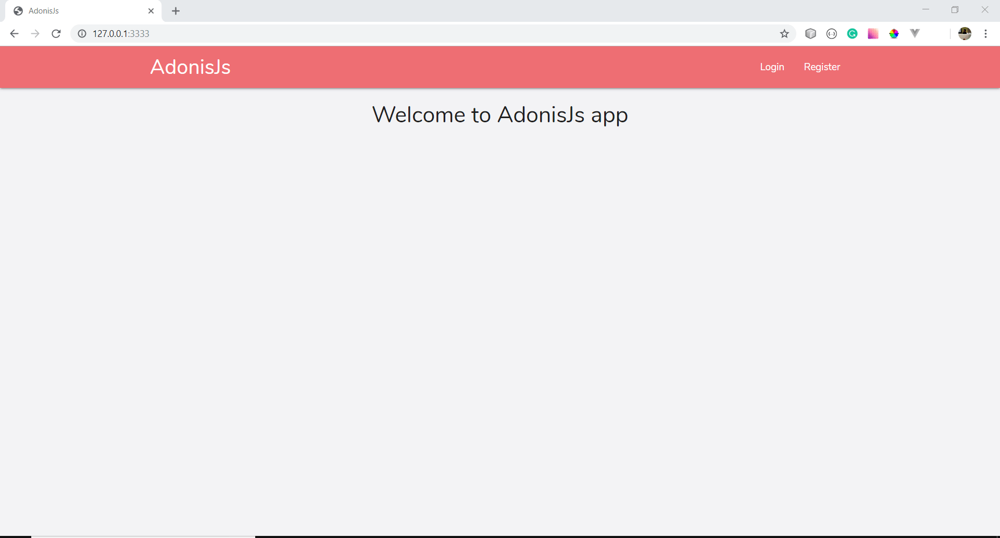

# Adonis materialize fullstack application



1. Bodyparser
2. Session
3. Authentication
4. Web security middleware
5. CORS
6. Edge template engine
7. Lucid ORM
8. Migrations and seeds

## Setup

Clone this repo and create your .env file

## setup your key

```bash
adonis key:generate
```

or manually clone the repo and then run `npm install`.

### Migrations

Run the following command to run startup migrations.

```js
adonis migration:run
```

Yeh... Start using the app
